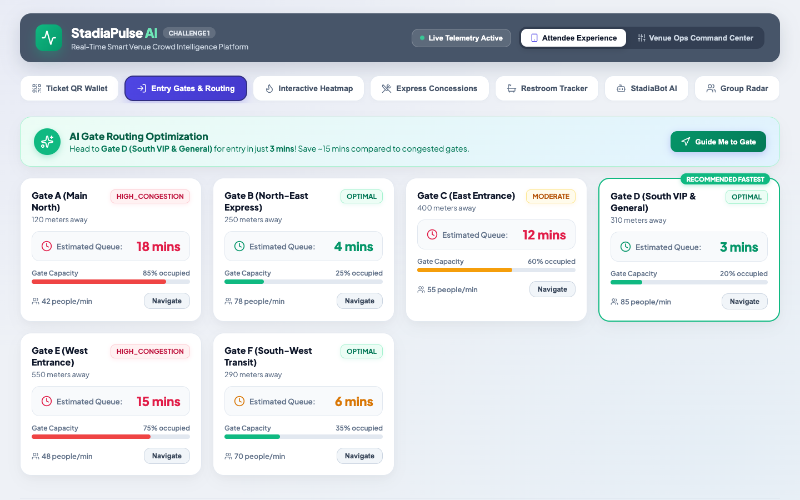
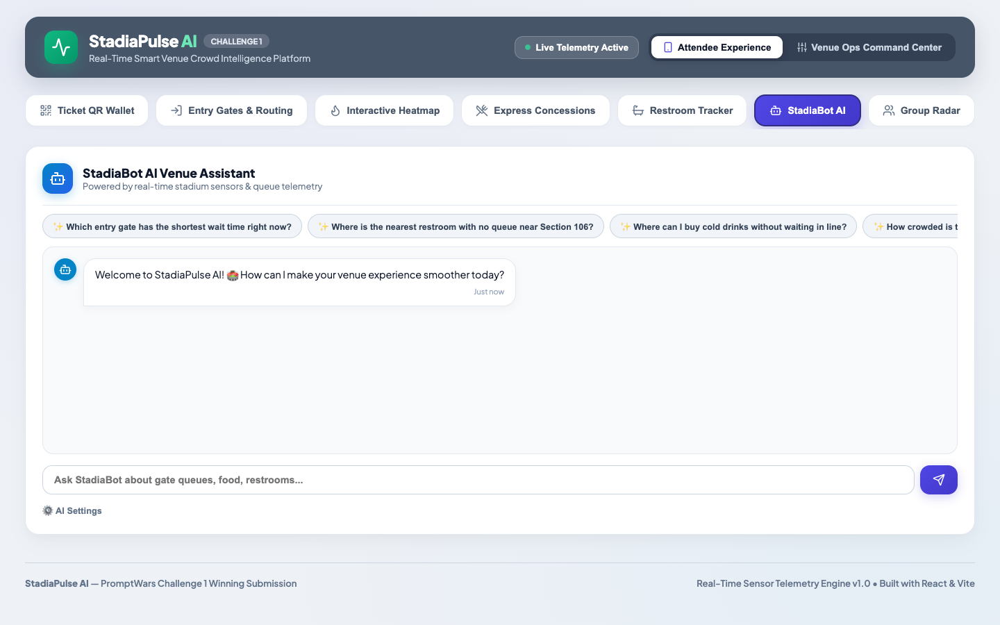
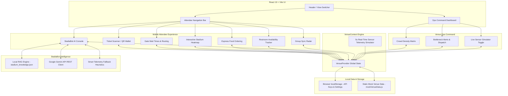

# 🏟️ StadiaPulse AI — Smart Venue Crowd Intelligence & Attendee Experience

[](https://vitejs.dev/)
[](https://react.dev/)
[](LICENSE)
[](https://github.com/features/actions)

> **PromptWars Virtual — Challenge 1 Submission**  
> *Real-time stadium crowd intelligence, AI gate routing, express concession ordering, and telemetry dashboard powered by React 19 & Google Antigravity AI.*

🌐 **[Live Demo: Play with StadiaPulse AI](https://gitphantom700.github.io/StadiaPulse-AI/)**

### 📸 Application Previews

*(Please take real screenshots of your application and save them in the `images/` folder with these names, or replace these links with your actual screenshots)*

#### Mobile Attendee Experience


#### Operations Command Center


#### StadiaBot Conversational AI


---

## 📌 Project Overview

---

## 🛑 Problem Statement

Large stadium events often face critical operational friction during peak moments:
- **Massive Gate Congestion:** Attendees face unpredictable wait times at entry points, leading to frustration and delayed entry.
- **Concourse Bottlenecks:** Crowds pile up in specific sectors while alternative routes remain empty.
- **Concession Delays:** Long lines for food and beverages reduce fan enjoyment and venue revenue.
- **Lack of Real-Time Coordination:** Venue operations staff lack the live, predictive telemetry needed to redirect fans *before* bottlenecks become critical.

**StadiaPulse AI** solves physical crowd congestion, gate security delays, concession line bottlenecks, and venue operations coordination for large-scale stadium events. It delivers a dual-interface platform:
1. **Attendee Mobile View**: Live entry gate wait times, stadium heatmaps, digital ticket wallet, mobile concessions pickup, restroom stall availability, group friend radar, and an interactive **StadiaBot AI Assistant**.
2. **Operations Command Center**: Live crowd telemetry matrix, bottleneck detection, dynamic gate throughput management, and real-time sensor simulation.

---

## 🏗️ System Architecture



---

## ✨ Key Features

### 📱 Attendee Experience View
- 🎟️ **Digital Ticket QR Wallet**: Instant event pass scanning, seat section verification, and personalized gate routing.
- 🚪 **AI Gate Routing Assistant**: Real-time wait times for Gates A through F with automatic fast-lane routing recommendations.
- 🏟️ **Interactive Stadium Heatmap**: Vector stadium pitch rendering featuring sector-by-sector crowd density heat maps and seat locator.
- 🍔 **Express Concessions**: Skip counter lines with mobile food/drink ordering, live prep status tracking, and pickup codes (`FL-42`).
- 🚽 **Restroom Tracker**: Live stall availability indicators (e.g., 11/18 open) and line wait estimation across all stadium concourses.
- 🤖 **StadiaBot AI Assistant**: Conversational AI assistant integrating venue policy RAG and live sensor telemetry (powered by Gemini API or fallback telemetry heuristics).
- 👥 **Group Sync Radar**: Coordinate live meetup locations and track friends attending the event.

### 🎛️ Venue Operations Command Center
- 📊 **Crowd Telemetry & Bottleneck Matrix**: Sector-level anomaly alerts, critical crowd density flags, and staff marshal dispatching.
- ⚡ **Dynamic Overflow Controls**: Open or re-route entry lanes dynamically when gate queues exceed threshold levels.
- 🔄 **Real-Time Telemetry Simulator**: Built-in 5-second interval simulation engine fluctuating queue data live for demo testing.

---

## 🛠️ Quick Start & Setup

### Prerequisites
- **Node.js**: v18.0.0 or higher
- **npm**: v9.0.0 or higher

### Installation

```bash
# 1. Clone the repository
git clone https://github.com/your-org/stadiapulse-ai.git
cd stadiapulse-ai

# 2. Install dependencies
npm install

# 3. Start local development server
npm run dev
```

Open `http://localhost:5173` in your browser to view the application.

### Available Scripts

| Script | Command | Description |
|--------|---------|-------------|
| **Dev** | `npm run dev` | Starts Vite local development server with hot module replacement |
| **Build** | `npm run build` | Bundles the application for production deployment into `dist/` |
| **Preview** | `npm run preview` | Previews the production build locally |
| **Lint** | `npm run lint` | Runs Oxlint code verification across all source files |

---

## 📖 Usage Guide

### 1. Navigating Between Views
- Use the header toggle button **"Switch to Ops Control Center"** / **"Switch to Attendee View"** to switch between fan experience and operations manager modes.

### 2. Setting Up Gemini AI Assistant
1. Click the **"Gemini API Key"** button in the top navigation header.
2. Enter your Gemini API key (obtained from Google AI Studio).
3. The key is securely stored in your browser's `localStorage` and never transmitted to external servers except direct calls to Google Generative AI endpoints.
4. If no API key is provided, StadiaBot automatically uses built-in smart telemetry heuristics to answer queries.

### 3. Using Mobile Concessions Ordering
1. Navigate to the **Express Concessions** tab.
2. Browse available food stands (e.g., *Stadia FastLane Grill*, *Craft Brew Corner*).
3. Click **"Order Now"** on any menu item.
4. View order status updates live (e.g., `PREPARING` → `READY_FOR_PICKUP`) with confetti celebration upon order completion.

### 4. Operations Telemetry Simulator
1. Switch to **Ops Control Center**.
2. Toggle the **"Live Telemetry Simulator"** switch to pause or resume real-time queue fluctuations.
3. Observe live gate throughput metrics and sector congestion status updates.

---

## 📂 Project Structure

```
challenge1/
├── .github/
│   ├── ISSUE_TEMPLATE/
│   │   ├── bug_report.md
│   │   └── feature_request.md
│   └── PULL_REQUEST_TEMPLATE.md
├── src/
│   ├── assets/           # Project images & static assets
│   ├── components/
│   │   ├── AttendeeView/   # Ticket, Gates, Heatmap, Food, Restrooms, AI Console, Friends
│   │   ├── OperationsView/ # Crowd Heatmap Ops Control Center
│   │   └── Header.jsx      # Header bar & API key settings modal
│   ├── context/
│   │   └── VenueContext.jsx # Global telemetry state & AI engine integration
│   ├── data/
│   │   ├── mockVenueData.js      # Venue geography & initial queue metrics
│   │   └── stadium_knowledge.json # RAG knowledge base for StadiaBot
│   ├── App.jsx           # Main application routing & tab layout
│   └── main.jsx          # React DOM entry point
├── CONTRIBUTING.md       # Open-source contribution guidelines
├── README.md             # Project overview & documentation
├── package.json          # Dependencies & scripts
└── vite.config.js        # Vite configuration
```

---

## 🤝 Contributing

Contributions are welcome! Please review our [CONTRIBUTING.md](CONTRIBUTING.md) guide for details on code style, issue reporting, and the pull request process.

---

## 📄 License

Distributed under the MIT License. See `LICENSE` for more details.
